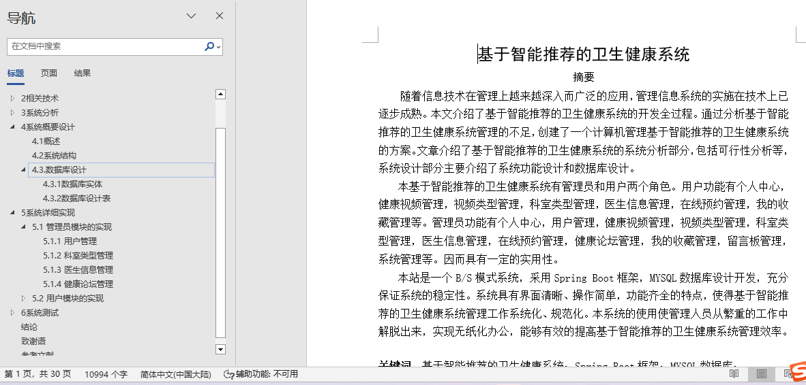
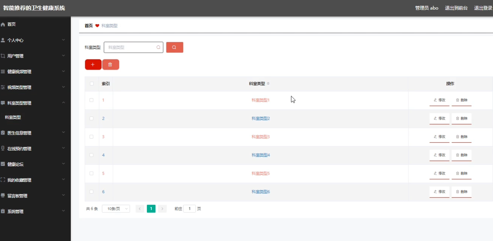
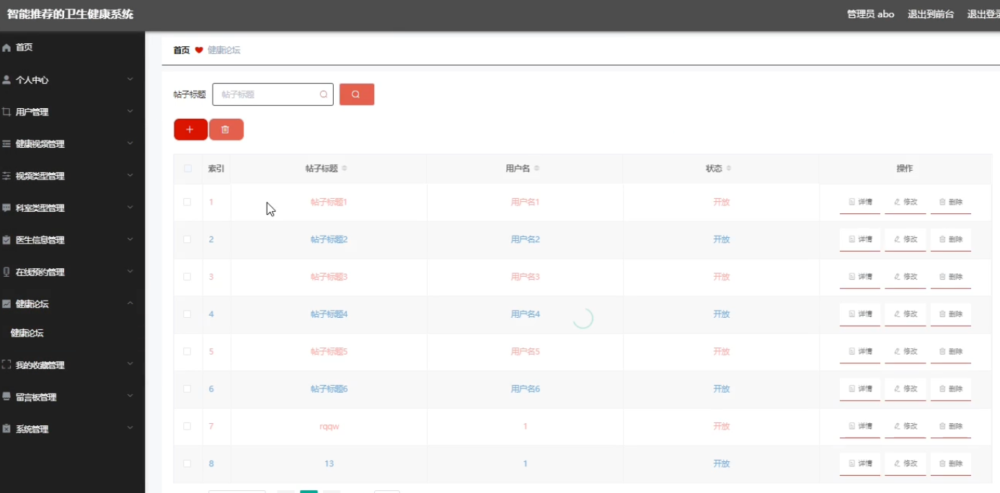

## 基于智能推荐的卫生健康系统(程序+报告)

###  获取sql数据库文件: 从戎源码网 (https://armycodes.com/) QQ: 386869957 QQ群: 377586148
###  所有系统地址: (https://github.com/YuLin-Coder/AllProjectCatalog) 
###  所有项目以及源代码本人均调试运行无问题 可支持远程安装部署调试、定制修改、代码讲解

## 项目介绍
基于智能推荐的卫生健康系统，系统包含两种角色：用户、管理员，系统分为前台和后台两大模块，主要功能如下：

1管理员模块的实现
用户管理
- 管理员可以对用户信息进行添加、修改、删除及查询操作。

科室类型管理
- 管理员可以对科室类型信息进行添加、修改、删除及查询操作。

医生信息管理
- 管理员可以对医生信息进行添加、修改、删除及查询操作。

健康论坛管理
- 管理员可以对健康论坛的信息进行修改和查询操作。

2用户模块的实现
我的发布
- 用户登录后，可以在个人中心查看和管理自己的发布信息，包括修改和删除操作。

我的收藏
- 用户登录后，可以在个人中心查看和管理自己的收藏信息，并可以取消收藏。

在线咨询
- 用户登录后，可以在首页点击在线咨询，提交咨询信息。

## 项目技术
- 编程语言：Java
- 数据库：MySQL
- 项目管理工具：Maven
- 前端技术：HTML、CSS、JavaScript、Jquery、Vue
- 后端技术：Spring、SpringMVC、MyBatis

## 运行环境
- JDK版本：JDK1.8及以上
- 开发工具：IDEA、Ecplise、Myecplise都可以
- 数据库: MySQL5.7及以上
- Maven：maven3.0及以上
- Node：14.14.0及以上

## 运行截图

